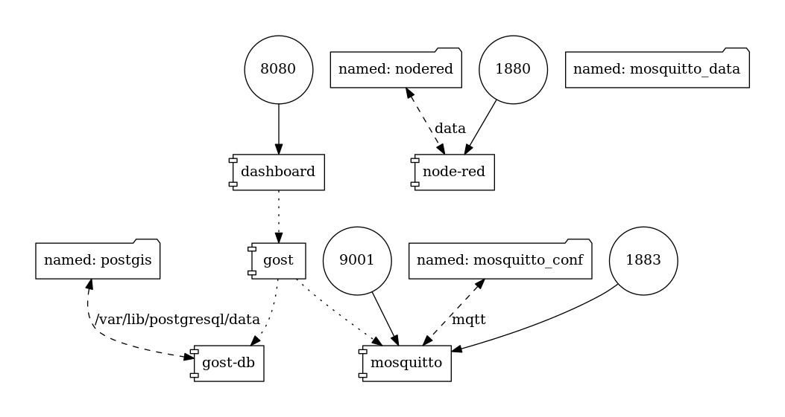

# GOST Docker support

For getting GOST to work in Docker there are three images available on Docker Hub

- [geodan/gost](https://hub.docker.com/r/geodan/gost/) containing the GOST server  
- [geodan/gost-db](https://hub.docker.com/r/geodan/gost-db/) containing an already configured postgis database  
- [geodan/gost-dashboard](https://hub.docker.com/r/geodan/gost-dashboard/) containing nginx and the GOST dashboard  

For more information about the containers check the projects on github: [geodan/gosts](https://github.com/gost/server) - [geodan/gost-db](https://github.com/gost/gost-db) - [ggeodan/ost-dashboard](https://github.com/gost/dashboard)

The docker images can run separately, or running in a combined way using the Docker-compose file.

## Running GOST with Docker-compose
Our default docker-compose file comes with a MQTT server (Mosquitto) and Node-RED, a handy tool that can be used with GOST.

Architecture:

<kbd></kbd>

Use the tag latest for the latest development version, otherwise use a tag like '0.5' for more stable versions.   

Running (unstable) latest build of GOST:
```
$ wget https://raw.githubusercontent.com/gost/docker-compose/master/docker-compose.yml 
$ docker-compose up
```
Running (stable) 0.5 build of GOST
```
$ wget https://raw.githubusercontent.com/gost/docker-compose/master/docker-compose-0.5.yml 
$ docker-compose -f docker-compose-0.5.yml up
```

or on Raspberry Pi (experimental):
```
$ wget https://raw.githubusercontent.com/gost/docker-compose/master/docker-compose-rpi.yml

$ sudo docker-compose -f docker-compose-rpi.yml up
```

For a complete tutorial about installing GOST on Raspberry Pi see https://github.com/gost/docs/blob/master/gost_raspberrypi.md

## Removing database

The data of the Postgis is stored on a Docker volume. If you want to remove the data use commands like:

```
$ docker-compose down -v
```
